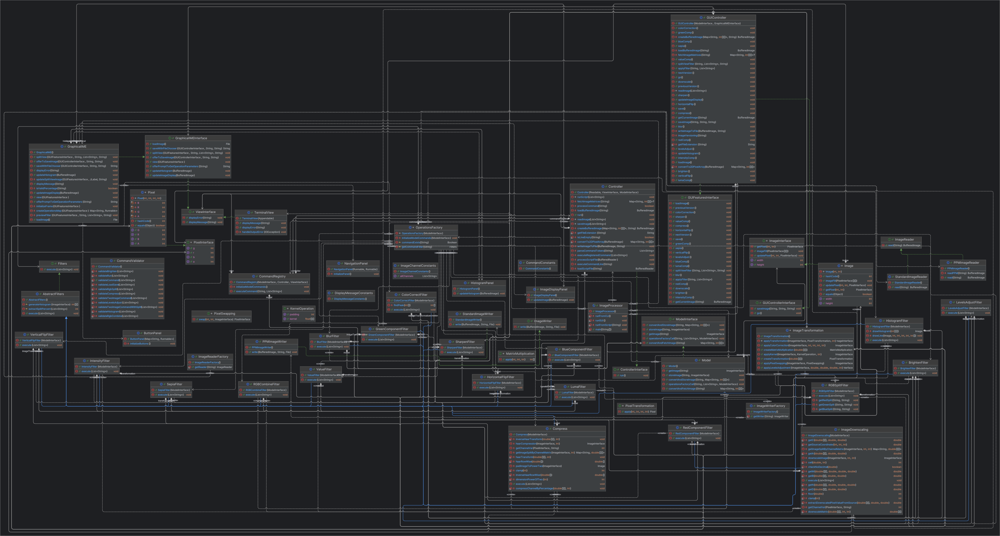

Implemented Dithering on the existing code: Y

(Details for Dithering is on the bottom of this file)

# Image Manipulation and Enhancement (IME)

### Class Diagram

### How to Run

1. *(This will run whole script file)* Run this command:
   ***java -jar <_PathToJarFileWithName_>.jar -file <_scriptFilePathWithName_>***
2. OR *(This will run commands one by one)* Run this cmd:
   ***java -jar <_PathToJarFileWithName_>.jar -text***
3. OR *(This will launch the GUI)* Run this cmd: ***java -jar <_PathToJarFileWithName_>.jar***

## Changes Part 1 -> 2

1) In earlier design we had a CommandRegistry class in controller package where we had a map of
   command actions ("blur") to filter functions (blurFunc()) but in new design we send tokenized
   commands directly to model where we then send it to OperationsFactory class where each command
   action is mapped to object of specific filter class (BlurFilter). We did it to shift from
   somewhat functional design to a more Object-Oriented approach.

2) Earlier we had all filter functions in one Model class inside model package but in new design we
   have separated out the filter into separate classes each of their own (BlurFilter, SharpenFilter
   etc). We did this because model class was getting too cluttered and we figured that for
   maintainability and readability reasons it was better to have more number of separate classes
   than to have all functions inside one file.

3) In previous design we had ImageTransformation class which contained some functional interfaces
   having pixel related operations like PixelSwapping (for flip), KernelOperations (for
   blur/sharpen) but we separated out the functional interfaces into class based interfaces to
   change it from functional approach to a more object oriented approach.

## Part 1 -> 2 changes justification

From the previous assignment itself we designed our code in such a way that packages and different
classes (whether in same package or different package) are agnostic to each other. Meaning the logic
and the low-level view of our design remains untouched while we tweak high level view (creating
extra classes, changing functional interface to class based interface) a little bit. So, it follows
the open/closed principle of the SOLID properties.

Our controller package is mostly untouched except the CommandRegistry class and our "model" package
also hasn't changed too much. We just extracted out the classes from "model" class into their own
separate classes rest everything remained same.

## Part 2 - New filters

### Project Structure

The project is organized into the following packages under the top-level `ime` package:

- `model`: Contains classes for image representation and processing.
- `view`: Implements the user interface.
- `controller`: Manages communication between the model and view and the user.

### Controller Package

Key classes:

- `Controller`: Main communication link between the main class and other packages.
- `CommandRegistry`: Makes call to factory inside model to execute appropriate filter classes.
- `CommandValidator`: Checks validity of commands and their arguments.
- `ImageReaderFactory` & `ImageWriterFactory`: Provide classes for reading/writing in different
  image formats.

### Model Package

Key classes:

- `Image`: Package-private class which represents image objects using a 2D array of pixels which in
  turn is represented by Pixel
  class. And, it is also a driver class for the model package, implements all image transformations.
- `ImageTransformation`: Package-private class which handles the pixel transformation logic.
- `Pixel`: Package-private class which represents individual pixels with RGBA values.
- `Model`: Public class which is main link to the controller.

### View Package

Key classes:

- `TerminalView`: Implements `ViewInterface` for command-line interaction.
- `ViewInterface`: Defines the contract for view implementations.

### Image Operations

#### Existing Operations

1. **Load Image**

- Usage: `load image-path image-name`
- Loads an image from the specified path and assigns it the given name for future reference.

2. **Save Image**

- Usage: `save image-path image-name`
- Saves the image with the given name to the specified path.

3. **Color Component Extraction**

- Usage: `<component>-component image-name dest-image-name`
- Creates a new image with only the specified color component (red, green, blue) or attribute (
  value, luma, intensity).
- Supported components: red, green, blue, value, luma, intensity

4. **Horizontal Flip**

- Usage: `horizontal-flip image-name dest-image-name`
- Flips the image horizontally and saves it as a new image.

5. **Vertical Flip**

- Usage: `vertical-flip image-name dest-image-name`
- Flips the image vertically and saves it as a new image.

6. **Brighten/Darken**

- Usage: `brighten increment image-name dest-image-name`
- Adjusts the brightness of the image by the given increment (positive or negative).

7. **RGB Split**

- Usage: `rgb-split image-name dest-image-name-red dest-image-name-green dest-image-name-blue`
- Splits the image into its red, green, and blue components, saving each as a separate image.

8. **RGB Combine**

- Usage: `rgb-combine image-name red-image green-image blue-image`
- Combines three images representing red, green, and blue components into a single color image.

9. **Blur**

- Usage: `blur image-name dest-image-name`
- Applies a blur effect to the image and saves the result as a new image.

10. **Sharpen**

- Usage: `sharpen image-name dest-image-name`
- Sharpens the image and saves the result as a new image.

11. **Sepia**

- Usage: `sepia image-name dest-image-name`
- Applies a sepia tone effect to the image and saves the result as a new image.

12. **Run Script**

- Usage: `run script-file`
- Loads and executes a series of commands from the specified script file.

### New Image Operations

#### Split View

The split view operation allows users to apply transformations to only a portion of the image,
creating a side-by-side comparison of the original and transformed image.

Usage: `<operation> <parameters> split <percentage>`

#### Histogram

Generates a histogram of the image, representing the distribution of color intensities.

Usage: `histogram <source-image> <dest-image>`

#### Color Correction

Automatically adjusts the color balance of the image to enhance its overall appearance.

Usage: `color-correct <source-image> <dest-image>`

#### Levels Adjustment

Allows fine-tuning of the image's tonal range by adjusting shadows, midtones, and highlights.

Usage: `levels-adjust <black> <mid> <white> <source-image> <dest-image>`

### Image Representations

- Model: Uses `Image` class objects.
- Controller: Uses `BufferedImage` and a list of four 2D integer arrays (RGBA).
- View: Does not directly represent images.

## Part 3 - GUI

### Changes Part 2 -> 3

There are no changes except "ImageProcessor" file which contains our main function.

1) We have added support to run GUI from main function.
2) Apart from this we have only added files to view and controller to support input from GUI.
3) Inside src->ime->controller you will find a 'gui' package which contains the 'GUIController' and
   its 2 interfaces. The 2 interfaces GUIControllerInterface and GUIFeaturesInterface expose
   different functions so that we don't expose any functions anyhere where we don't want to.
4) Inside src->ime->view you will find a 'gui' package which contains the 'GraphicalIME' which is
   the main view file which implements 'GraphicalIMEInterface'.
5) Other classes inside view->gui are ButtonPanel, HistogramPanel, ImageDisplayPanel and
   NavigationPanel which have code to initialise and form panels for buttons, histogram, image
   display and navigation (next, previous buttons to navigate images being worked on).

### Code Flow

#### 'ImageProcessor' Main class

1) Image processor class instantiates model, view and controller.
2) GUIController instantiation receives model and view objects.
3) GUIController's go() method is then called which in turn calls 'view()' inside 'GraphicalIME' and
   launches our GUI.

#### GUIController

1) This controller implements 2 interfaces as explained above as well for controlled access to it's
   objects.
2) This controller has generic image operation methods like loadImage(), saveImage(),
   getCurrentImage() etc.
3) Apart from above it also exposes the filter operation methods which are being called directly
   from the view upon action event.
4) These methods send info to model to get the opration done.
5) Controller finally pings the view and updates the display.

#### 'GraphicalIME' View class

1) This view file initialises frames and panels upon starting.
2) After this it recieves action events from button clicks and calls the appropriate controller
   funcs.
3) Upon receiving update from controller it displays the image on the panel.

### IMPORTANT - *Split Operation Working*

There is no separate split view button.
Upon clicking a filter button, it asks you if you want a preview in the form of a split view. If you
select 'Yes' then only it shows you the split view.
Inside split preview you can enter any value between 0-100 (100 means filter applies to whole
preview image) and click 'update preview' to preview operations being applied to that much portion
of the image.
Use 'apply' button to apply filter to the actual image OR 'cancel' to not apply the filter.

### GUI View

The view has buttons like "Load Image" and "Save" and others for images filter operations which user
can interact with using mouse clicks.

### Added Features

1) ***Image Stack Navigation***
   You can navigate between images, that are being worked upon, using 'previous' and 'next' on the
   top panel of the main frame. You can even choose which image you want to apply your next
   operation to!
   This is done in order to keep our app in sync with the terminal view capabilities. Since, we
   allow the said flexibility in cmd line view so we thought it should be present in gui view as
   well.
2) **Image Downscaling**
   We have added an extra feature this time which lets you downscale an image. It requires 2 inputs
   from users width and height to which you want to downscale it to.

### Affects/Changes on Model

Model remains unchanged! Our previous model robustly works as is!

### Sample Image

The `Manas.jpeg` and `Manas.png` image used for testing is an original photograph taken by the
project team and
authorized for use in this project.

------

# Dithering Implementation

## Files Modified

### 1. `src/ime/CommandConstants.java`

- **Changes**:
    - Added a new constant `DITHER` to identify the dithering command across the application.
- **Purpose**:
    - Provide a unique identifier for the dithering operation.

### 2. `src/ime/controller/CommandValidator.java`

- **Changes**:
    - Added a validation method `validateDither()`.
    - Updated the command switch statement to include dithering validation.
- **Purpose**:
    - Ensure the dither command is properly validated before execution.

### 3. `src/ime/controller/gui/GUIController.java`

- **Changes**:
    - Implemented a new `dither()` method.
- **Purpose**:
    - Create a method to trigger the dithering process from the GUI.
    - Prepares arguments for the dithering operation.
    - Calls `splitView()` to display the processed image on the preview window.

### 4. `src/ime/model/OperationsFactory.java`

- **Changes**:
    - Added the `ImageDither` to the `commandActions` map.
- **Purpose**:
    - Register the dithering operation in the application's command processing system.

### 5. `src/ime/model/ImageDither.java`

- **Changes**:
    - Created a new class to implement the dithering functionality.
    - Extends `AbstractFilters`.
    - Implements the `execute()` method for performing the dithering operation.
    - Includes a custom `getSplitImage()` method.
- **Problem**:
    - The existing split view implementation was tightly coupled with specific features.
- **Solution**:
    - Reimplemented a separate split view method (`getSplitImage()`) in the `ImageDither` class.
